# Document Editor Quick Guide

## Introducción

### Barra estándar
*  Barra con las opciones estándar de un editor de documentos .

### Barra vertical
*  Barra con las opciones para interactuar con las marcas, marcos y
asistente

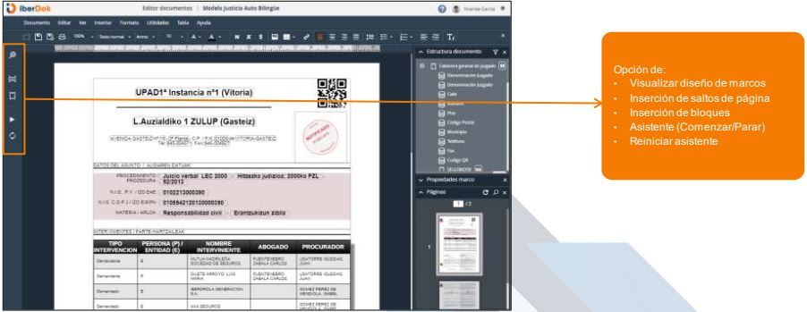

### Paneles laterales
*  Paneles que pueden ser visibles o no según decisión del usuario

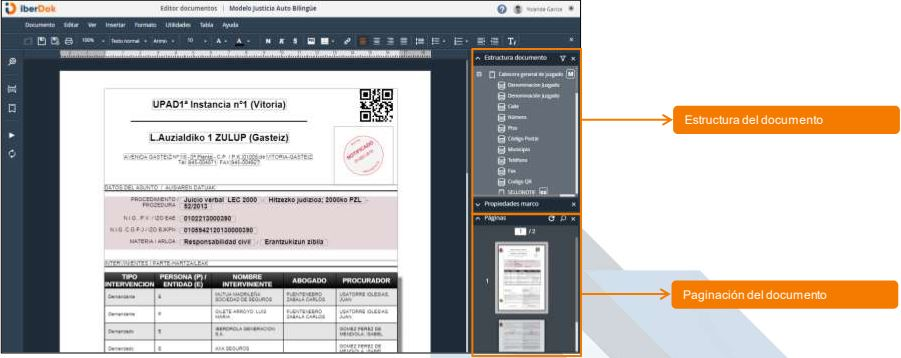

*  Paneles que pueden ser visibles o no según decisión del usuario

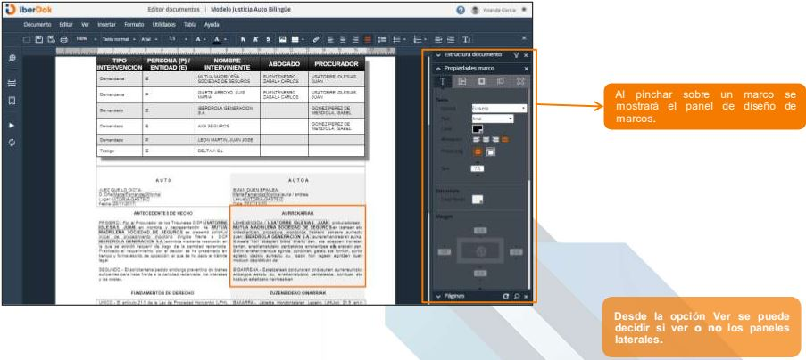

## Menú vertical
### Composición atendida

*  El asistente se abre en los documentos que tienen marcas sin resolver
necesitando la interacción del usuario para continuar

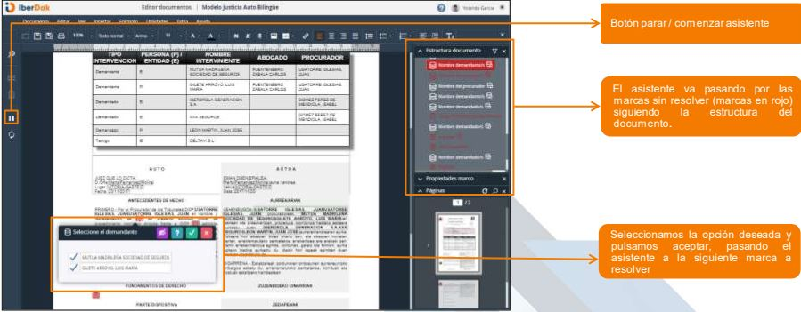

*  Interacción del usuario para resolver las marcas

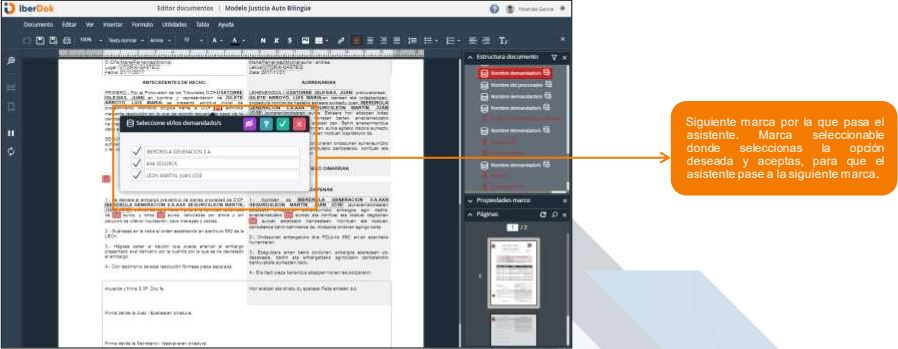

### Acceso a las marcas

*  Según el tipo de marca y sus características el acceso a los datos de las
marcas es diferente .
Marca de datos

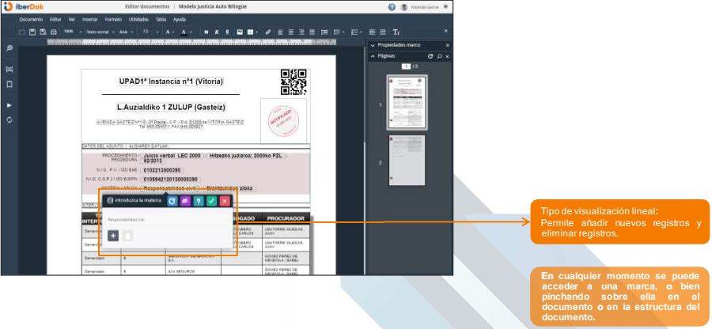

*  Marca de datos

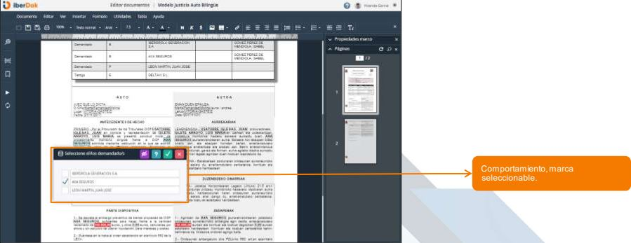

*  Marca de datos

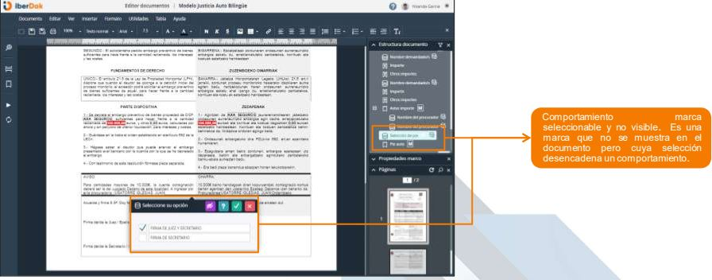

*  Marca de datos

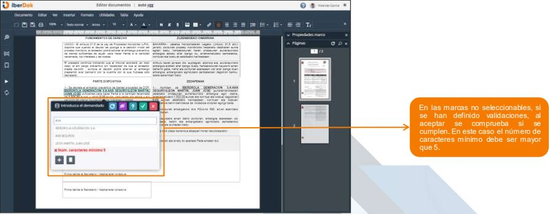

*  Marca de datos

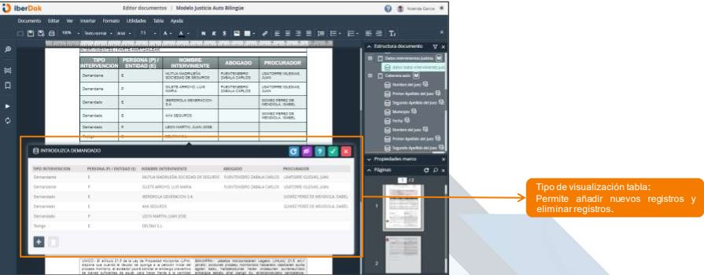

*  Marca de datos

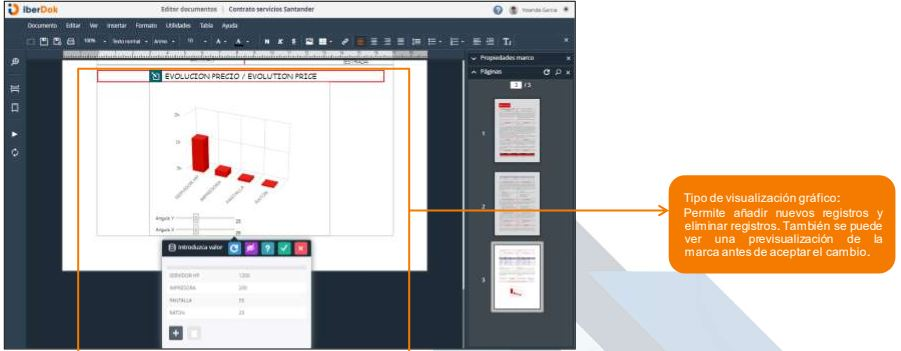

*  Marca de datos

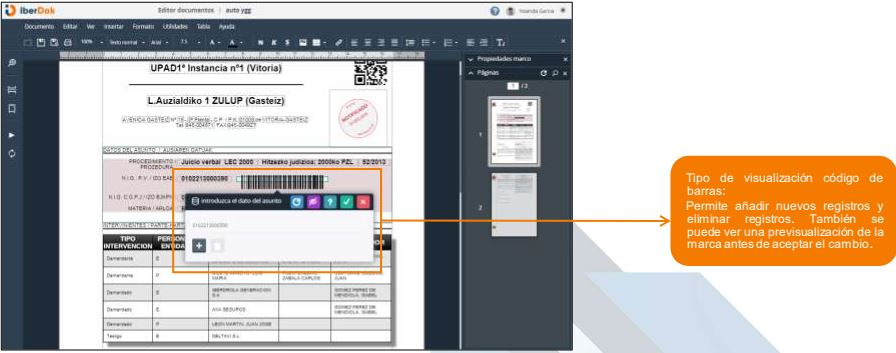

*  Marca de texto: formato numérico

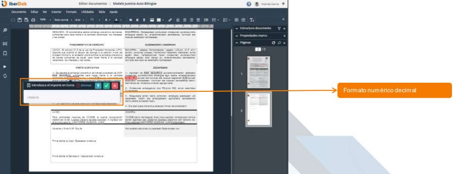

*  Marca de datos

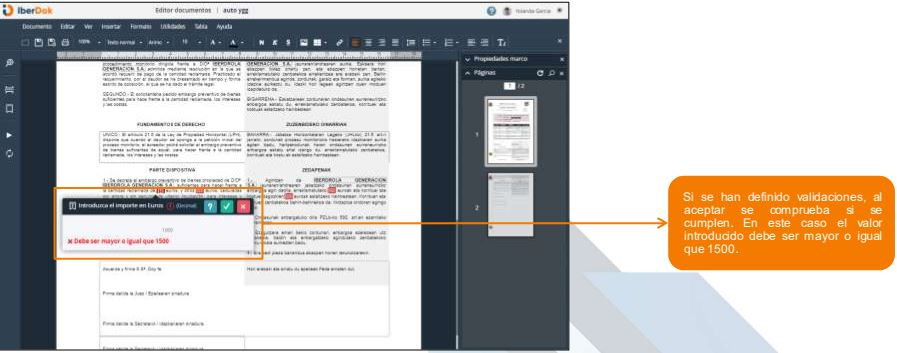

*  Marca de texto: formato fecha

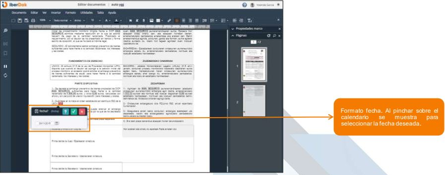

*  Marca de texto: formato texto enriquecido

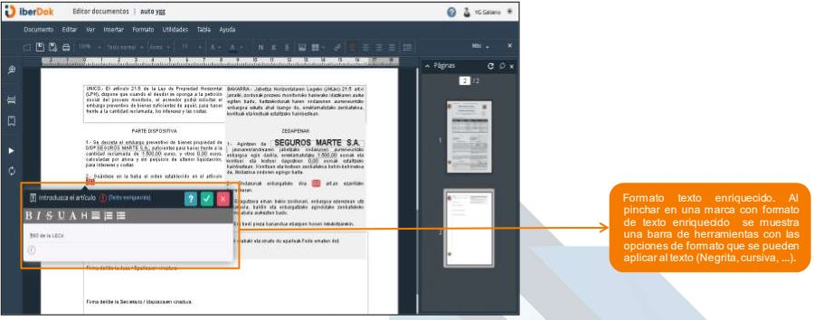

*  Marca de texto: formato escritura a mano alzada

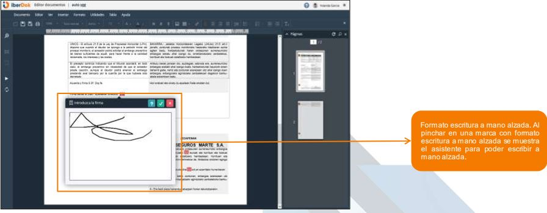

*  Marca de texto: formato imagen

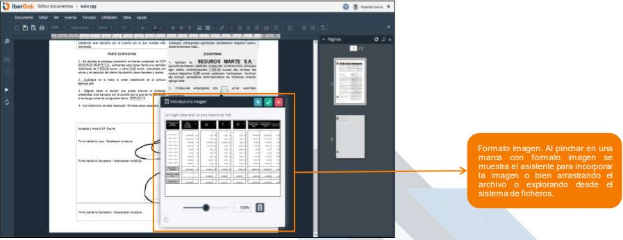

*  Marca de texto: formato documento anexo (por referencia / por
contenido)

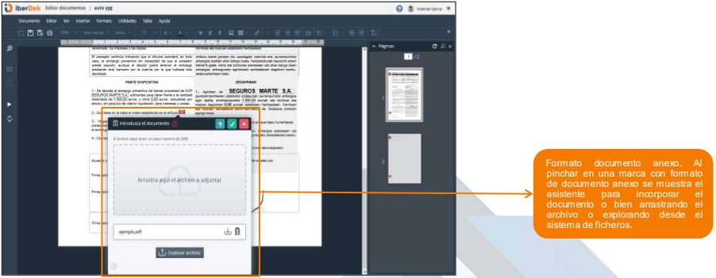

*  Marca de grupo de bloques

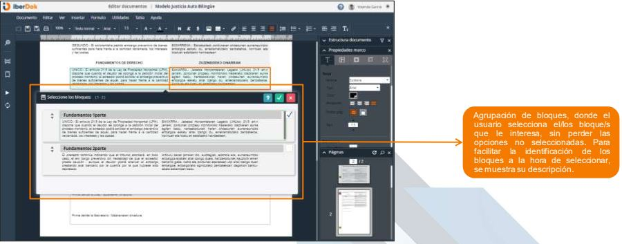

*  Marca de bloque

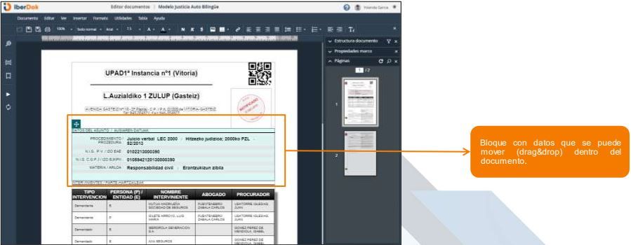

### Inserción de bloques
## Menú horizontal (barra estándar)
### Utilidades
### Guardar/finalizar documento
### Documentos multiidioma

Diagrama
===

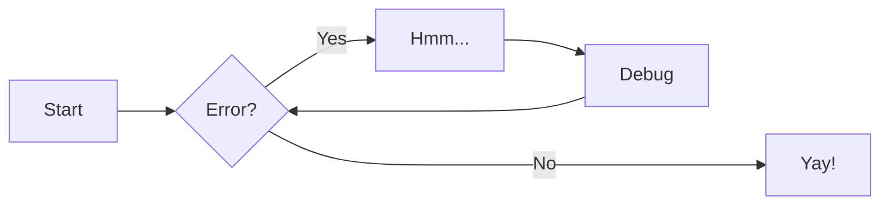

[Mas diagramas aqui](https://squidfunk.github.io/mkdocs-material/reference/diagrams/)

## Project layout

    mkdocs.yml    # The configuration file.
    docs/
        index.md  # The documentation homepage.
        ...       # Other markdown pages, images and other files.
        

