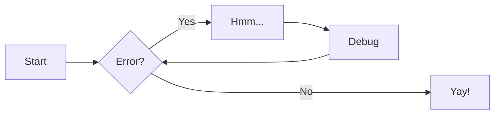

# Dokumentuen editorearen gida azkarra

## Introducción

### Barra estándar
*  Barra con las opciones estándar de un editor de documentos .

### Barra vertical
*  Barra con las opciones para interactuar con las marcas, marcos y
asistente

### Paneles laterales
*  Paneles que pueden ser visibles o no según decisión del usuario

*  Paneles que pueden ser visibles o no según decisión del usuario

## Menú vertical
### Composición atendida

*  El asistente se abre en los documentos que tienen marcas sin resolver
necesitando la interacción del usuario para continuar

*  Interacción del usuario para resolver las marcas

### Acceso a las marcas

*  Según el tipo de marca y sus características el acceso a los datos de las
marcas es diferente .
Marca de datos

*  Marca de datos

*  Marca de datos

*  Marca de datos

*  Marca de datos

*  Marca de datos

*  Marca de datos

*  Marca de texto: formato numérico

*  Marca de datos

*  Marca de texto: formato fecha

*  Marca de texto: formato texto enriquecido

*  Marca de texto: formato escritura a mano alzada

*  Marca de texto: formato imagen

*  Marca de texto: formato documento anexo (por referencia / por
contenido)

*  Marca de grupo de bloques

*  Marca de bloque

### Inserción de bloques
## Menú horizontal (barra estándar)
### Utilidades
### Guardar/finalizar documento
### Documentos multiidioma

Diagrama
===

[Mas diagramas aqui](https://squidfunk.github.io/mkdocs-material/reference/diagrams/)

## Project layout

    mkdocs.yml    # The configuration file.
    docs/
        index.md  # The documentation homepage.
        ...       # Other markdown pages, images and other files.
        

